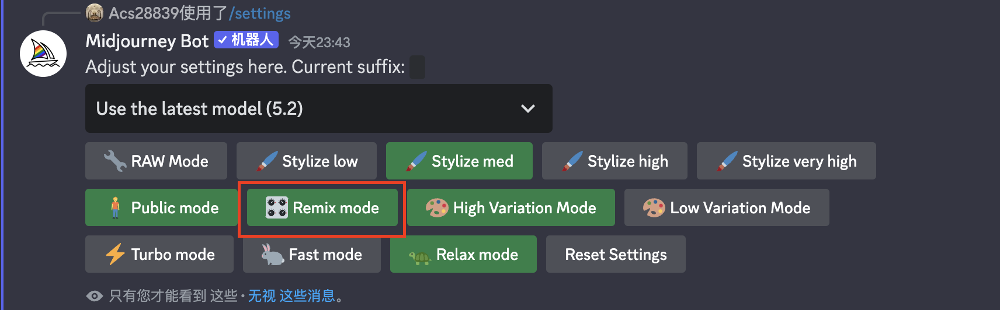

# midjourney-proxy-starter
[](https://www.github.com/novicezk/midjourney-proxy)
[](https://www.apache.org/licenses/LICENSE-2.0.html)

> 修改自项目：[midjourney-proxy](https://github.com/novicezk/midjourney-proxy)的2.3.5版本

## 项目介绍
适用于 springboot 框架的，可依赖引入项目的 MidJourney discord频道代理，实现api形式调用AI绘图。

## 更新记录
### 2.4.0
- 2023-08-06：修复UV操作
- 2023-08-06：新增Remix操作

## 使用前提
1. 注册 MidJourney，创建自己的频道，参考 https://docs.midjourney.com/docs/quick-start （需要多大的并发量创建多少个频道）
2. 将 midjourney 生成模式调整为Remix mode 
3. 获取用户Token、服务器ID：[获取方式](./docs/discord-params.md)
4. 不同于 midjourney-proxy 本项目将自动获取服务器下存在的所有频道。
5. 由于任务匹配规则的修改，一个频道只能同一时间生成一张图片，因此 你的并发数==你的频道总数，请根据实际情况调整频道数，或维护一个队列。

## 支持功能
- [x] 支持 Imagine 指令和相关U、V操作
- [x] 支持 Remix 指令
- [x] Imagine 时支持添加图片base64，作为垫图
- [x] 支持 Blend(图片混合) 指令和相关U、V操作
- [x] 支持 Describe 指令，根据图片生成 prompt
- [x] 支持 Imagine、V、Blend 图片生成进度
- [x] user-token 连接 wss，可以获取错误信息和完整功能
- [x] 支持 discord域名(server、cdn、wss)反代，配置 mj.ng-discord

## 计划功能
- [ ] 支持新MJ新指令
- [ ] 暂未想到

## 使用方法 
#### [接口文档](#target)

1. 引入依赖
```xml
<dependency>
    <groupId>com.prechatting</groupId>
    <artifactId>midjourney-proxy-starter</artifactId>
    <version>2.4.0</version>
</dependency>
```
如果你的项目是spring-boot-web项目，需要排除spring-boot-starter-webflux依赖
```xml
<dependency>
    <groupId>com.prechatting</groupId>
    <artifactId>midjourney-proxy-starter</artifactId>
    <version>2.4.0</version>
    <exclusions>
        <exclusion>
            <groupId>org.springframework.boot</groupId>
            <artifactId>spring-boot-starter-webflux</artifactId>
        </exclusion>
    </exclusions>
</dependency>
```
2. 配置参数
```yaml
mj:
  discord:
    - guild-id: xxx # discord服务器ID
      user-token: xxx # discord用户Token
    - guild-id: xxx
      user-token: xxx
  task-store:
    type: in_memory
    timeout: 30d
  translate-way: null
  queue:
    timeout-minutes: 5
    core-size: 3
    queue-size: 10
  proxy:
    host: 127.0.0.1 # 代理host
    port: 1090 # 代理端口
```
3. 调用接口(去掉`/mj`路由，其余与midjourney-proxy一致)
```
//例如：
POST http://IP:端口/submit/imagine
Content-Type: application/json
Body:        
        {
        "prompt":"a cat",
        "base64":"data:image/png;base64,i
        }
```
4. 代码调用
```java
//例如：
@Autowired
private MJService mjService;

@PostMapping(value = "/image")
public ResultEntity image(@RequestBody SubmitImagineDTO submit) {
        SubmitResultVO imagine = mjService.imagine(submit);
        return new ResultEntity().ok().data(imagine);
        }

@GetMapping(value = "/task/{id}")
public ResultEntity task(@ApiParam(value = "任务ID") @PathVariable String id) {
        Task fetch = mjService.fetch(id);
        return new ResultEntity().ok().data(fetch);
        }
```
5. 自定义账号选择策略
```java
// 实现DiscordConfigService接口，重写getDiscordConfig方法，注入容器即可
import com.prechatting.ProxyProperties;
import com.prechatting.service.DiscordConfigService;
import org.springframework.stereotype.Service;

import java.util.List;

@Service
public class PersonalDiscordConfigService implements DiscordConfigService {
    @Override
    public ProxyProperties.DiscordConfig getDiscordConfig(List<ProxyProperties.DiscordConfig> discordConfigs) {
        return discordConfigs.get(0);
    }
}
```
6. 启动项目
```log
# 启动日志，项目启动后依次出现如下日志，表示连接成功
[midjourney-proxy-starter] > 正在初始化与discord的连接...
[gateway] Connected to websocket. userToken:xxx, guildId:xxx
[midjourney-proxy-starter] > 与discord的连接初始化完成，共获取到 channel：4 个
```


## 风险须知
1. 作图频繁等行为，可能会触发midjourney账号警告，请谨慎使用
2. 为减少风险，请设置`mj.discord.user-agent` 和 `mj.discord.session-id`
3. 默认使用user-wss方式，可以获取midjourney的错误信息、图片变换进度等，但可能会增加账号风险
4. 支持设置mj.discord.user-wss为false，使用bot-token连接wss，需添加自定义机器人：[流程说明](./docs/discord-bot.md)

## 配置项
- mj.discord.guild-id：discord服务器ID
- mj.discord.channel-id：discord频道ID
- mj.discord.user-token：discord用户Token
- mj.discord.session-id：discord用户的sessionId，不设置时使用默认的，建议从interactions请求中复制替换掉
- mj.discord.user-agent：调用discord接口、连接wss时的user-agent，默认使用作者的，建议从浏览器network复制替换掉
- mj.discord.user-wss：是否使用user-token连接wss，默认true
- mj.discord.bot-token：自定义机器人Token，user-wss=false时必填
- 更多配置查看 [Wiki / 配置项](https://github.com/novicezk/midjourney-proxy/wiki/%E9%85%8D%E7%BD%AE%E9%A1%B9)

## 本地开发
- 依赖java17和maven

## 其它
- 多用户依然采用 midjourney-proxy 启动时创建ws链接的方式，因此需要在启动前添加多个账号，由于账号成本太贵，未尝试过作图请求时进行ws链接，推测可能会有封号风险，各位可以自行改动尝试，如果没被封请告知一下；
- 如果觉得这个项目对你有所帮助，请帮忙点个star；

## 联系方式
- Email: xianlinyi@outlook.com
- Wechat: 


<a name="target"></a>
## 通用参数
### 1.IProgressListener
实现此监听器，在调用对应方法的时候传入监听器，可以监听任务的进度变化
```java
/**
 * 任务监听器
 */
public interface IProgressListener {
    /**
     * 任务开始
     * @param task
     */
    void onStart(Task task);

    /**
     * 任务进度变动
     * @param task
     */
    void onProgress(Task task);

    /**
     * 任务成功
     * @param task
     */
    void onSuccess(Task task);

    /**
     * 任务失败
     * @param task
     */
    void onFail(Task task);
}

```
## 接口文档

### 1. Imagine
#### 调用接口
```java
public class example{
    @Autowired
    MJService mjService;

    public void imagine(SubmitImagineDTO imagineDTO) {
        DefaultProgressListener defaultProgressListener = new DefaultProgressListener();
        SubmitResultVO result = mjService.imagine(imagineDTO, defaultProgressListener);
    }
}
```
#### 参数说明
```java
@Data
@ApiModel("Imagine提交参数")
@EqualsAndHashCode(callSuper = true)
public class SubmitImagineDTO extends BaseSubmitDTO {

	@ApiModelProperty(value = "提示词", required = true, example = "Cat")
	private String prompt;

	@ApiModelProperty(value = "垫图base64")
	private String base64;

}
```

### 2. U/V/Remix
#### 调用接口
```java
public class example{
    @Autowired
    MJService mjService;

    public void uv(SubmitUVDTO uvDTO) {
        DefaultProgressListener defaultProgressListener = new DefaultProgressListener();
        SubmitResultVO uv = mjService.uv(uvDTO, defaultProgressListener);
    }
}
```
#### 参数说明
```java
@Data
@ApiModel("变化任务提交参数")
@EqualsAndHashCode(callSuper = true)
public class SubmitChangeDTO extends BaseSubmitDTO {
    @ApiModelProperty(value = "任务ID", required = true, example = "\"1320098173412546\"")
    private String taskId;
    
	@ApiModelProperty(value = "任务信息", required = true)
	private Task task;

	@ApiModelProperty(value = "remix的提示词")
	private String remixPrompt;

	@ApiModelProperty(value = "UPSCALE(放大); VARIATION(变换); REROLL(重新生成); REMIX(提示词混合)", required = true,
			allowableValues = "UPSCALE, VARIATION, REROLL, REMIX", example = "UPSCALE")
	private TaskAction action;

	@ApiModelProperty(value = "序号(1~4), action为UPSCALE,VARIATION时必传", allowableValues = "range[1, 4]", example = "1")
	private Integer index;


}
```
## 使用实践
### 使用 event-stream 流式返回任务进度
```java
@Service
public class ImagineServiceImpl implements ImagineService {
    @Autowired
    MJService mjService;

    @Override
    public Flux<String> imagine(SubmitImagineDTO imagineDTO) {
        return Flux.create(fluxSink -> {
            IProgressListener imagineListener = new IProgressListener() {
                @Override
                public void onStart(Task task) {
                    // 将数据推送到Flux中
                    fluxSink.next(JSON.toJSONString(task));
                }

                @Override
                public void onProgress(Task task) {
                    fluxSink.next(JSON.toJSONString(task));
                }

                @Override
                public void onSuccess(Task task) {
                    fluxSink.next(JSON.toJSONString(task));
                    fluxSink.next("[DONE]");
                    fluxSink.complete();
                }

                @Override
                public void onFail(Task task) {
                    fluxSink.next(JSON.toJSONString(task));
                    throw new RuntimeException(task.getFailReason());
                }
            };
            mjService.imagine(imagineDTO, imagineListener);
        });
    }
}
```
